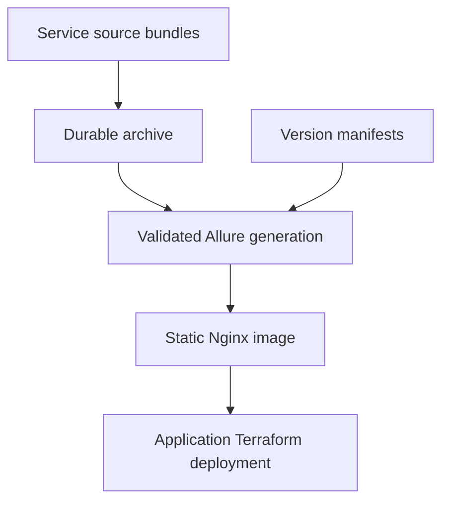

# ECommerceStore LiveDocs

## Purpose

LiveDocs assembles executable BDD scenarios, Allure results, OpenAPI contracts,
business flows and validation policies into one stateless documentation image.
Service repositories own their tests and sources; LiveDocs owns version manifests,
generation, the static host and Docker Hub publication.

[ECommerceStore.Infrastructure](https://github.com/MichalBoczula/ECommerceStore.Infrastructure)
creates Azure resources in Terraform and deploys this image with the whole
application. LiveDocs has no independent Azure deployment workflow. Its CI archive reader
identity is provisioned by application Infrastructure.

## Engineering approach

### Designed contracts, executable sources

Producers supply raw Allure 2 results, Reqnroll feature files and generated API,
flow and validation descriptions. LiveDocs validates source identity, package
inventory, checksums and attachments before generating documentation. It displays
failed BDD results faithfully; host readiness is independent of test status.
See the [artifact contract](docs/artifact-contract.md).

### Versioned documentation

Each image contains every retained manifest snapshot. `/livedoc/v1/products/`,
`/livedoc/v1/users/` and `/livedoc/v2/products/` can coexist. Registering another
project requires a registry and manifest entry, with no Nginx routing change.
Development versions can advance; released versions cannot be changed or removed.
The `latest` navigation pointer chooses a version without overwriting its history.

The production manifest has an empty development v1 until the first verified Products manifest PR is merged.
Test fixtures use separate manifests for v1 Products/Users and v2 Products,
including a failed result. They are never used for the published production image.

## Architecture



| Component | Responsibility |
| --- | --- |
| `manifests/` and `schemas/` | Project registry, selected versions, identities and package contracts |
| `scripts/livedocs.py` | Safe archive validation, immutable releases and atomic site assembly |
| Docker builder | Pinned Allure generation; Java and Python stay in this stage |
| `nginx/` and final image | Static documentation, health endpoints and build identity |
| `scripts/ci.sh` | Portable verification commands used locally and by Actions |
| Application Infrastructure | Terraform, storage/access lifecycle, ACA resources and deployment |

Git stores code and manifests. Source ZIPs and generated reports remain outside
Git. The final container contains Nginx and static content, with no Java, Python or
Allure installation. Replicas never modify documentation; a new snapshot requires
a new image. See the [ADR index](docs/adr/README.md).

## Technology stack

| Area | Technology |
| --- | --- |
| Host | Non-root Nginx, HTTP 8080 |
| Generation | Allure CLI **2.46.1**, Java 17 in the builder |
| Build tooling | Python 3.12, jsonschema |
| Contracts | JSON Schema, content-addressed ZIP packages and manifests |
| Tests | unittest, JUnit XML, coverage.py, actual Docker HTTP checks |
| Containers | Docker, Docker Compose, Docker Hub |
| CI | GitHub Actions, pip-audit, Dependency Review, Gitleaks, Trivy |

Allure's official distribution SHA-256 is pinned in
[`tools/allure.json`](tools/allure.json). ProductsCatalog uses the same CLI pin locally and
Allure.Reqnroll 2.14.1 with Reqnroll.xUnit 3.3.0. CLI and .NET adapter versions
are independent.

### Repository structure

```text
manifests/
schemas/
scripts/
site/
nginx/
tests/
docs/
  adr/
```

## Local startup

### Prerequisites

Docker with a running daemon and Compose, Bash, and Python **3.12+**. Docker installs
Java and Allure in the builder; they are not needed on the host for Compose.
Install `requirements-ci.txt` in a virtual environment for full local verification.

### Run with Docker Compose

```bash
docker compose up --build --detach
python3 scripts/smoke.py http://127.0.0.1:8080 --expected-sha local
```

Open <http://localhost:8080/livedoc/>. Stop with `docker compose down`.
No runtime environment variables, secrets, database or service API connection are
required. Compose uses a read-only root filesystem and writable `/tmp`.

## HTTP contract

| Path | Behavior |
| --- | --- |
| `/` or `/livedoc` | Redirect to `/livedoc/` |
| `/livedoc/` | Version navigation |
| `/livedoc/latest/` | HTML redirect to the selected latest version |
| `/livedoc/v1/` | Projects published in that version |
| `/livedoc/v1/products/` | Provenance, BDD, API, flows and policies when published |
| `/livedoc/v1/products/allure/` | Allure report with relative assets and data |
| `/livedoc/catalog.json` | Selected versions and artifact references |
| `/build-info.json` | LiveDocs commit SHA and build timestamp |
| Unknown paths/assets | HTTP 404; no SPA fallback |

Project pages link to source JSON and bundle metadata. Preserve `/livedoc/` through
application ingress so report links and assets resolve.

## Health checks

| Route | Meaning |
| --- | --- |
| `/health/live` | Nginx is responding; independent of documentation content |
| `/health/ready` | Baked-in site marker exists; 503 when absent |

Readiness does not mean that BDD tests passed or upstream APIs are healthy. The
[container contract](docs/container-contract.md) describes probes, port, identity,
filesystem and Terraform consumption.

## Tests

```bash
python3 -m venv .venv
source .venv/bin/activate
pip install -r requirements-ci.txt
bash scripts/verify.sh
```

Local verification calls the same `scripts/ci.sh` entry points as Actions. Assembly
regressions enforce archive integrity, safe extraction, attachment and identity
checks, immutable releases and atomic generation. Hosting regressions cover HTTP
failure detection, the quality gate and publication boundaries. The assembly suite
requires at least **70% line coverage of `scripts/livedocs.py`**, with no lines
excluded. This is generator coverage, not a percentage for all scripts or Nginx.

Actual Docker tests generate Allure fixtures and check version/project routes,
assets, test cases, attachments, 404s and commit identity. The host must run as
101:101 with a read-only root and no build toolchain. A hidden site returns
readiness 503 while liveness remains 200. See [local verification](docs/local-verification.md)
for focused commands and artifact paths.

## CI

The workflow uses `scripts/ci.sh` for source contracts, Python/Bash/Compose checks,
assembly and hosting suites, real Allure fixture generation, dependency audit,
image build, smoke tests and publication. `scripts/verify.sh` shares those checks.
Actions owns job dependencies, uploads, secrets and external scanners.

PRs into and pushes to `main`, plus manual runs, require build, assembly, hosting,
documentation, Python dependency audit and secret scan. PRs additionally require
Dependency Review at high/critical severity. pip-audit checks direct/transitive
build and CI requirements and fails on known advisories. JUnit XML, generator
coverage, fixture evidence and summaries use `artifacts/verification/`.

An explicit quality gate requires every applicable job to succeed. Only then does
CI build the production image once, smoke-test it and scan high/critical fixable
findings with Trivy. PRs never publish. Main pushes and manual main runs publish
that same tested/scanned image to:

- `mb0101/ecommerce-store-livedocs:latest`;
- `mb0101/ecommerce-store-livedocs:<full-commit-sha>`.

| Repository secret | Purpose |
| --- | --- |
| `DOCKERHUB_USERNAME` | Account with write access to the image repository |
| `DOCKERHUB_TOKEN` | Docker Hub publication token |

CI verifies both tags use the scanned local image and pushes report the same digest.
The publication summary and `livedocs-image/image.json` artifact identify the
immutable image for Infrastructure. Azure OIDC login is limited to archive inputs; deployment stays in Infrastructure.
See [CI ADR](docs/adr/0004-ci-and-verification.md) and
[Definition of Done](docs/definition-of-done.md).

## Operations

Use the published digest as application Terraform's image input. Public Docker Hub
access permits credential-free pulls; private registry access belongs to
Infrastructure. It also owns Azure storage, identities, ingress, probes and scaling.

Archive every package referenced by a retained manifest. Private inputs must be
prefetched outside Docker into the verified cache; never pass credentials as build
arguments. CI prefetch is required for nonempty manifests. See
[producer integration](docs/producer-integration.md) for identities, protected
environments, GitHub App setup and the first Products handoff. Missing or invalid packages fail the build;
the existing deployed image continues serving its baked-in snapshot.

## Architecture decisions

The [ADR index](docs/adr/README.md) covers the static host, versioned Allure snapshots,
application-owned deployment and shared CI verification. Contributors and agents
should read [`AGENTS.md`](AGENTS.md) and [Definition of Done](docs/definition-of-done.md).

| Task | Deliverable |
| --- | --- |
| LD/1 | Static container, health checks and Docker Hub publication — implemented |
| LD/2 | Versioned manifests, archive tooling, Allure 2 and documentation pages — implemented |
| LD/3 | Image handoff to application Terraform — implemented |
| LD/4 | Invoice-style README/ADRs, portable CI, security and quality gates — implemented |
| LD/5 | Blob-backed Products integration, manifest import and private build inputs — setup required |

[LD/5 setup and delivery flow](docs/producer-integration.md) describes the separate
`livedocs` container, opt-in scheduled imports, producer pin and archive access.
